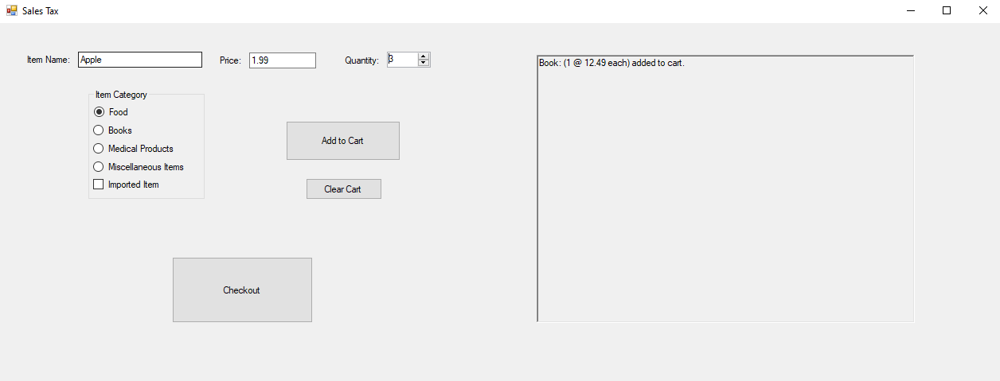

# This is a WinForms application for the DealerOn "Sales Taxes" programming test

Users can enter an item name, price, and quantity, select the category of the item, and then add that item to the cart with the "Add to Cart" button. Users can add as many items to the cart as they want, then check out with the "Checkout" button, which will then calculate the taxes and totals for all the items in the cart, and output the results.

Each item's name is unique, so adding an item named "Book", and then adding another "Book" item will update the quantity of the existing item, but not update the price, because they're considered the same item. Whereas, "Book 1" is a different item from "Book 2", and can have individual prices and quantities.

